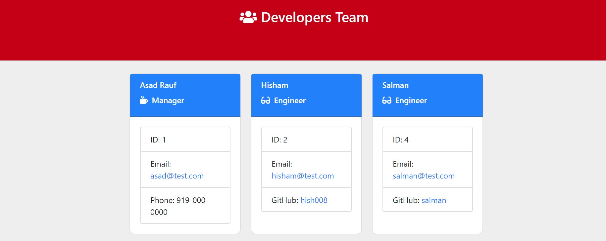

 
 
### random-team-generator  

>  #This CLI will generate a Software Engineer Team using javascript OOP concepts. The application will prompt the user for information about the team manager and then information about the team members. The user can input any number of team members, and they may be a mix of engineers and interns. When the user has completed building the team, the application will create an HTML file that displays a nicely formatted team roster based on the information provided by the user.

These are the programming languages that we used to built this good developer profile generator
**node.js javascript OOP node modules classes inquirer module**

     

**This is a developer profile generator command line application using node js**

## Install  
npm install
npm install will download a package and it's dependencies. npm install can be run with or without arguments. When run without arguments, npm install downloads dependencies defined in a package.json file and generates a node_modules folder with the installed modules

## Run Tests  
test
Implement test that are excetable to check our classes output

## Author
**Asad Rauf**
- Github : [@asadrauf](https://github.com/asadrauf)

## License 
MIT: 
---
**axios and chalk and prompt-checkbox** 
## Contributing
**asad**
Issues, Feature requests are most welcomed!. There are still issues and anyone can help to fixed the issues. Pull requests are welcome. For major changes, please open an issue first to discuss what you would like to change.

## Show your support :pray:
Give a :star: or follow me if this project helped you.
### Any suggestion or question are most welcome
 Email : [umiasad2017@gmail.com](asadrauf)

*This APP was generated with :heart: by Full Stack developer Asad Rauf*

